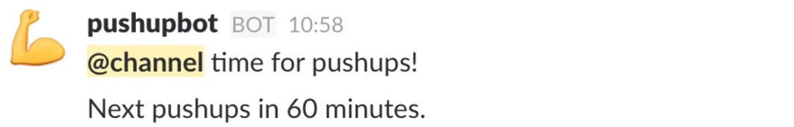

# Pushup Bot

Slackbot that reminds the team to do their periodic pushups.

## Running

The following environment variables are used:

- `START_TIME`: The time of day that the first pushups shall be done, including time zone. E.g. "09:25 US/Eastern"
- `PERIOD_MINUTES`: The length of the period between sets.
- `END_TIME`: No notices will be posted at or after this time.
- `ACTIVE_WEEKDAYS`: List of weekdays that notices will be sent. Default is "MTWRF", possible values "MTWRFSU".
- `SLACK_API_TOKEN`
- `SLACK_CHANNEL`

## Deployment

Built in Ruby. Can be deployed to Heroku or similar infrastructure.

## Development

We use RSpec to describe the functionality of the system and to ensure it meets those specifications.
